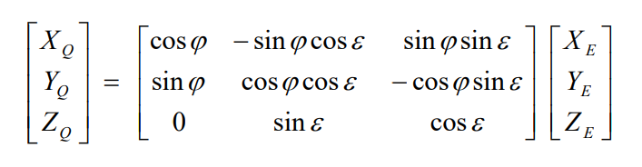

# Time Scale and Reference System

The time used in VSOP2013 series is TDB (Barycentrc Dynamical Time).

This time can be considered equal to TAI + 32.184 s with an approximation less than 0.002s (TAI: International Atomic Time).

The solution VSOP2013 is fitted to the numerical integration INPOP10a over the time interval \[1890-2000].

The VSOP2013 coordinates are referred to the inertial frame defined by the dynamical equinox and ecliptic J2000 (JD 2451545.0).

The planetary coordinates of INPOP10a are referred in ICRF.

If XE, YE, ZE are the rectangular coordinates of a planet computed from VSOP2013, the rectangular coordinates of the planet in equatorial frame of the ICRF, XQ, YQ, ZQ, may be obtained by the following rotation:

<figure><figcaption></figcaption></figure>

with: **ε** = 23° 26' 21.41136" et **φ** = -0.05188"
