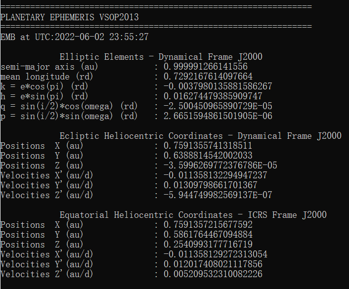
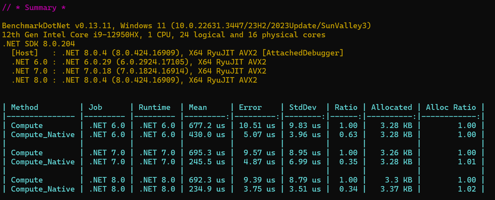

# VSOP2013 .NET 

[](https://www.nuget.org/packages/VSOP2013.NET/)
[](https://www.nuget.org/packages/VSOP2013.NET/)

## What's this?

VSOP was developed and is maintained (updated with the latest data) by the scientists at the Bureau des Longitudes in Paris.

VSOP2013,another version of VSOP, computed the positions of the planets directly at any moment, as well as their orbital elements with improved accuracy.

Original VSOP2013 Solution was write by FORTRAN 77 . It's too old to use.

This repo is not just programming language translation, it's  refactoring of VSOP2013.

This thing is totally useless for myself. But I think someone might need this algorithm in the future.

VSOP2013 is much much slower than VSOP87. Maybe more accurate than 87?

I use multi-thread and precalculation technique to accelerate iteration speed.

I promise it will be much faster than origin algorithm.

This is the best VSOP2013 library ever.



## Performance

<br>

Note: .NET 8 occurs performance regression due to RyuJIT bugs. [Detail Here](https://github.com/dotnet/runtime/issues/95954#issuecomment-1956661569)

## Features

1. Use `VSOPResult` class to manage calculate results.
2. Use `VSOPTime` class to manage time. 
<br>Easy to convert time by calling ```VSOPTime.UTC```, ```VSOPTime.TAI```, ```VSOPTime.TDB```
3. Very high performance per solution using multithread.
4. Useful Utility class. Convert Elliptic coordinates to cartesian and spherical 
5. Async Api included.
6. precalculation on <b>φ</b> in terms, which gives 20%+ speed up.
7. Use [MemoryPack](https://github.com/Cysharp/MemoryPack) for binary serialize.
<br>Initialization time becomes less than 10% of previous version.
8. LZMA2 compression on source data. ~300Mb -> ~43MB.
9. Optional Native Side library accelerate. (60%+ speed up, Only on Windows)

<br> 

## Documentation

[Gitbook](https://zangai-family.gitbook.io/vsop2013.net/)

## Enviroment Require

.NET 8 Runtime

Windows 10 64bit with AVX2 for native accelerate

## Reference
 [MemoryPack](https://github.com/Cysharp/MemoryPack)
 
 [FastLZMA2](https://github.com/kingsznhone/FastLZMA2Net)

